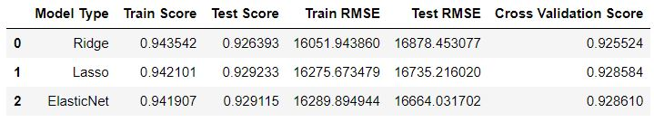
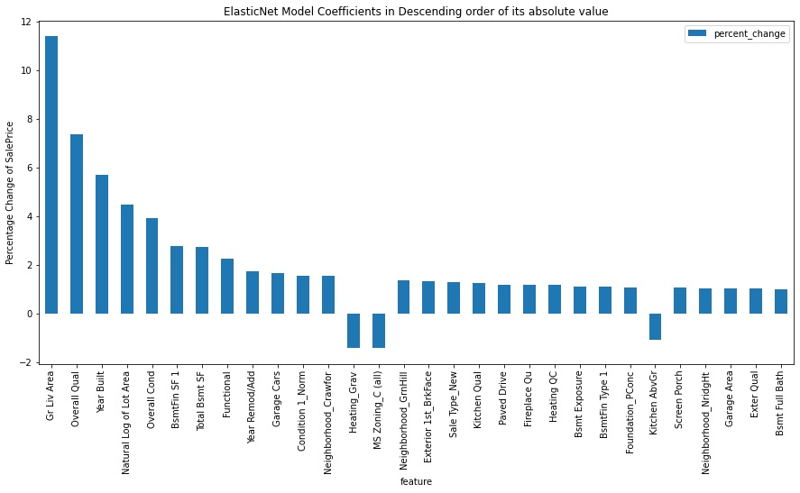
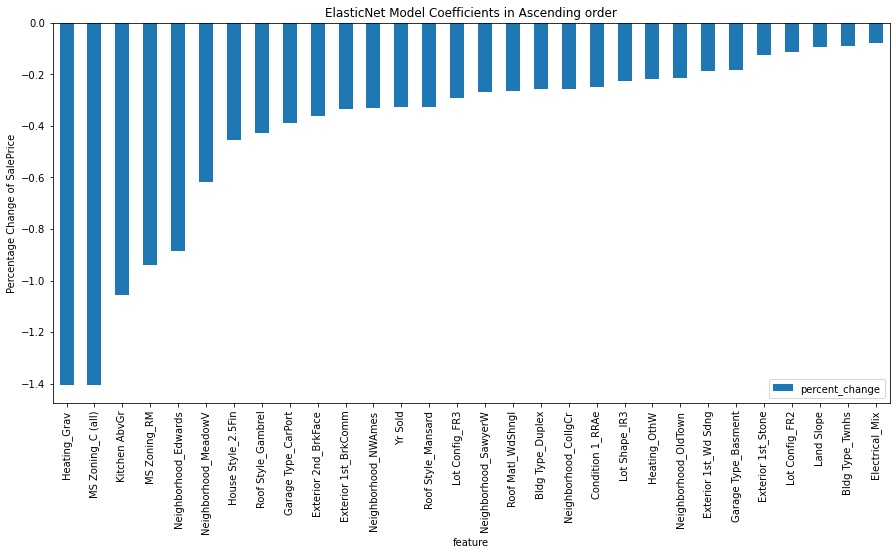

# Background
A real estate investment company ideally buys houses at low prices and sell them high for a profit. As a data scientist working at such a company based in Ames, Iowa, we are tasked to build a machine learning model to predict the true value of a house. Using the model predictions as a reference, the company will then be able to decide if a house is underpriced or overpriced.

The data used is the [Ames housing dataset][1] that was compiled by Dean De Cock. It describes the sale of individual residential property in Ames, Iowa from 2006 to 2010.

[1]: http://jse.amstat.org/v19n3/decock.pdf "Title"

# Problem Statement
Using a regression model, predict the true value of a house in Ames, Iowa with an RMSE of less than $20K.

Identify features of a house with the highest positive impact on its SalePrice.

Identify features of a house with the highest negative impact on its SalePrice.

# Data Dictionary
Adapted from [De Cock's Data Documentation][2]

[2]: http://jse.amstat.org/v19n3/decock/DataDocumentation.txt "Title"

| Feature |	Type	| Description |
| --- | --- | --- |
|Id	|Discrete	|Observation Number	|
PID |Nominal| Parcel identification number  - can be used with city web site for parcel review.
|MS SubClass | Nominal | Identifies the type of dwelling involved in the sale.|
MS Zoning | Nominal | Identifies the general zoning classification of the sale. |
Lot Frontage | Continuous | Linear feet of street connected to property |
Lot Area |Continuous| Lot size in square feet|
Street|Nominal| Type of road access to property
Alley |Nominal| Type of alley access to property
Lot Shape |Ordinal| General shape of property
Land Contour |Nominal| Flatness of the property
Utilities |Ordinal| Type of utilities available
Lot Config |Nominal| Lot configuration
Land Slope |Ordinal| Slope of property
Neighborhood |Nominal| Physical locations within Ames city limits (map available)
Condition 1 |Nominal| Proximity to various conditions
Condition 2 |Nominal| Proximity to various conditions (if more than one is present)
Bldg Type |Nominal| Type of dwelling
House Style |Nominal| Style of dwelling
Overall Qual |Ordinal| Rates the overall material and finish of the house
Overall Cond |Ordinal| Rates the overall condition of the house
Year Built |Discrete| Original construction date
Year Remod/Add |Discrete| Remodel date (same as construction date if no remodeling or additions)
Roof Style |Nominal| Type of roof
Roof Matl |Nominal| Roof material
Exterior 1 |Nominal| Exterior covering on house
Exterior 2 |Nominal| Exterior covering on house (if more than one material)
Mas Vnr Type |Nominal| Masonry veneer type
Mas Vnr Area |Continuous| Masonry veneer area in square feet
Exter Qual |Ordinal| Evaluates the quality of the material on the exterior
Exter Cond |Ordinal| Evaluates the present condition of the material on the exterior
Foundation |Nominal| Type of foundation
Bsmt Qual |Ordinal| Evaluates the height of the basement
Bsmt Cond |Ordinal| Evaluates the general condition of the basement
Bsmt Exposure	|Ordinal| Refers to walkout or garden level walls
BsmtFin Type 1	|Ordinal| Rating of basement finished area
BsmtFin SF 1 |Continuous| Type 1 finished square feet
BsmtFinType 2	|Ordinal| Rating of basement finished area (if multiple types)
BsmtFin SF 2 |Continuous| Type 2 finished square feet
Bsmt Unf SF |Continuous| Unfinished square feet of basement area
Total Bsmt SF |Continuous| Total square feet of basement area
Heating	|Nominal| Type of heating
HeatingQC |Ordinal| Heating quality and condition
Central Air |Nominal| Central air conditioning
Electrical |Ordinal| Electrical system
1st Flr SF |Continuous| First Floor square feet
2nd Flr SF |Continuous| Second floor square feet
Low Qual Fin SF |Continuous| Low quality finished square feet (all floors)
Gr Liv Area |Continuous| Above grade (ground) living area square feet
Bsmt Full Bath |Discrete| Basement full bathrooms
Bsmt Half Bath |Discrete| Basement half bathrooms
Full Bath |Discrete| Full bathrooms above grade
Half Bath |Discrete| Half baths above grade
Bedroom |Discrete| Bedrooms above grade (does NOT include basement bedrooms)
Kitchen |Discrete| Kitchens above grade
KitchenQual |Ordinal| Kitchen quality
TotRmsAbvGrd	|Discrete| Total rooms above grade (does not include bathrooms)
Functional |Ordinal| Home functionality (Assume typical unless deductions are warranted)
Fireplaces |Discrete| Number of fireplaces
FireplaceQu |Ordinal| Fireplace quality
Garage Type |Nominal| Garage location
Garage Yr Blt |Discrete| Year garage was built
Garage Finish |Ordinal| Interior finish of the garage
Garage Cars |Discrete| Size of garage in car capacity
Garage Area |Continuous| Size of garage in square feet
Garage Qual |Ordinal| Garage quality
Garage Cond |Ordinal| Garage condition
Paved Drive |Ordinal| Paved driveway
Wood Deck SF |Continuous| Wood deck area in square feet
Open Porch SF |Continuous| Open porch area in square feet
Enclosed Porch |Continuous| Enclosed porch area in square feet
3-Ssn Porch |Continuous| Three season porch area in square feet
Screen Porch |Continuous| Screen porch area in square feet
Pool Area |Continuous| Pool area in square feet
Pool QC |Ordinal| Pool quality
Fence |Ordinal| Fence quality
Misc Feature |Nominal| Miscellaneous feature not covered in other categories
Misc Val |Continuous| $Value of miscellaneous feature
Mo Sold |Discrete| Month Sold (MM)
Yr Sold |Discrete| Year Sold (YYYY)
Sale Type |Nominal| Type of sale
Sale Condition |Nominal| Condition of sale
SalePrice |Continuous| Sale price

# Methodology

1. Data cleaning and missing value imputation
2. Exploratory Data Analysis and Outlier Removal
3. Normalizing distributions of selected features
4. Data Modeling using Linear Regression, Ridge, Lasso, ElasticNet
5. Scoring models based on test R2 scores and test RMSE
6. Selecting the best performing model based on the above metrics

# Key Findings
## Model Selection

- The objective of the model is to predict the true value of a given house. Hence, how well the model generalizes to new data is very important. With that, the 2 results to pay attention to are Test Score (the higher the better) and Test RMSE (the lower the better).

### Observations:
- Although the Ridge model has the highest Train Score, it also has the lowest Test Score. In other words, it is the worst at generalizing to new data.
- Although the Lasso model has higher Train (0.0206% higher) and Test (0.0127% higher) Scores than the ElasticNet model, the ElasticNet model has a lower Test RMSE (0.425% lower).
- ElasticNet performed the best for Test RMSE and Cross Validation

### Insights:
- Both Lasso and ElasticNet have very similar Test Scores. Generally, they perform to the same level when generalizing to new data.
- Between Lasso and ElasticNet, the difference in Test RMSE is more significant than the difference in Test Scores. 0.425% vs 0.0127% difference.
- The objective of this model is to drive profit for the company by identifying the true value of a house and hence purchase it at a low price. Since the Test Score is so similar, we should look at the model with the lower RMSE to ensure our predictions in general are closer to the true value.
- Additionally, ElasticNet also performed the best for Cross Validation
- Hence, ElasticNet is the best performing model.

### ElasticNet Coefficients

### These are the features with the highest positive impact on SalePrice:
- Gr Liv Area: SalePrice increase of 11.39% per square foot increase of Above grade (ground) living area square feet
- Overall Qual: SalePrice increase of 7.36% per improvement in rating of the overall material and finish of the house
- Year Built: SalePrice increase of 5.71% per year later a house is built
- Lot Area: SalePrice increase of 4.4% per 1% increase in lot area
- Overall Cond: SalePrice increase of 3.93% per improvement in rating of the overall condition of the house

### Although these features have the highest SalePrice increase per unit increase, thinking logically, continuous features will have the most impact on SalePrice compared to ordinal and categorical features as they have a larger capacity to increase.

### Hence, the 5 most impactful features are:
- Gr Liv Area: Increase of 11.39% per square foot increase of Above grade (ground) living area square feet
- Lot Area: Increase of 4.4% per 1% increase in lot area
- BsmtFin Type 1: Increase of 2.8% per square foot increase in Type 1 finished square feet
- Total Bsmt SF: Increase of 2.74% per square foot increase in total basement area
- Garage Area: Increase of 1.04% per square foot increase in garage size

### High Impact Categorical Features:
- Condition 1: Houses with Normal proximity to various conditions such as feeder streets or railways saw a 1.58% increase in SalePrice compared to houses that are not.
- Neighborhood: Houses in Crawford saw a 1.57% increase in SalePrice compared to houses in other neighborhoods.
- Exterior 1: Houses with Brick Face for exterior covering saw a 1.35% increase in SalePrice compared to houses with other exterior coverings.

### These are the 5 features with the highest negative impact on SalePrice:
- Heating_Grav: SalePrice decrease of 1.406% when the house has a gravity furnace for heating
- MS Zoning_C (all): SalePrice decrease of 1.405% when the house is in a commercial zone
- KitchenAbvGr: SalePrice decrease of 1.058% per increase in number of Kitchens above grade
- MS Zoning_RM: SalePrice decrease of 0.938% when the house is in a residential zone with medium density
- Neighborhood_Edwards: SalePrice decrease of 0.887% when the house is in the Edwards neighborhood

# Conclusions and Recommendations

### The results are consistent with common sense where increasing the size of a house will also increase its SalePrice.

### The houses with the following features should command a higher price, assuming other features are constant.

- Large liveable area and lot size.
- Large basement of good quality
- Large garage of good quality
- Good overall quality and condition of the house
- Newly built or remodeled
- Situated in Crawford, Green Hills, Northridge Heights, Stone Brook or Somerset
- Situated at a normal proximity to various conditions such as feeder streets or railways
- Has Brick Face for exterior covering

### Conversely, the houses with the following features should command a lower price, assuming other features are constant.
- Gravity furnace for heating
- Large number of kitchens above grade
- Situated in a commercial or residential zone with medium density
- Situated in the Edwards neighborhood

# Buy Low and Sell High
Whether to buy a house depends on a case-by-case basis. While the identified features can help to guide this decision, at the end of the day, the rule of thumb is still to buy low and sell high. If the asking price of a house is lower than its predicted true value, the company should definitely consider to purchase it.

### Future Steps

- As the years pass, more data should be added to the dataset for further model training

# Citations
1. [Ames Housing Dataset][1]
2. [De Cock's Data Documentation][2]
3. [Interpreting Log Transformations in a Linear Model][3]

[1]: http://jse.amstat.org/v19n3/decock.pdf "Title"
[2]: http://jse.amstat.org/v19n3/decock/DataDocumentation.txt "Title"
[3]: https://data.library.virginia.edu/interpreting-log-transformations-in-a-linear-model/ "Title"
